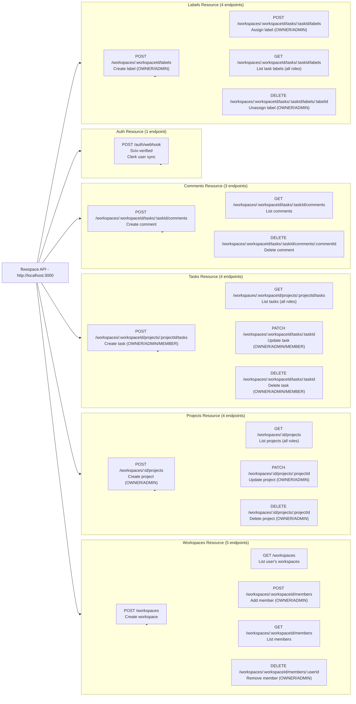

# API Endpoint Map

**Project:** flowspace
**Base URL:** `http://localhost:3000`
**Total Endpoints:** 21
**Resources:** 6 (auth, workspaces, projects, tasks, comments, labels)
**API Version:** 0.0.1
---

## Overview

This diagram provides a visual map of every REST endpoint exposed by the flowspace API, grouped
by resource. Endpoints are color-coded by HTTP verb and annotated with the minimum role required
to invoke them (all protected endpoints require a valid Clerk JWT in addition to the listed role).

The `POST /auth/webhook` endpoint is the only public endpoint - it is verified via Svix rather than
a Clerk JWT.

---

## Endpoint Map



---

## Endpoint Reference Table

| Method | Path | Resource | Role Required | Notes |
|--------|------|----------|---------------|-------|
| POST | `/auth/webhook` | auth | Public (Svix-verified) | Clerk user sync — currently handles `user.created` only (others acknowledged but no-op) |
| POST | `/workspaces` | workspaces | Authenticated | Create a workspace; caller becomes OWNER |
| GET | `/workspaces` | workspaces | Authenticated | List workspaces the caller belongs to |
| POST | `/workspaces/:workspaceId/members` | workspaces | OWNER / ADMIN | Add a user to a workspace |
| GET | `/workspaces/:workspaceId/members` | workspaces | Any member | List workspace members |
| DELETE | `/workspaces/:workspaceId/members/:userId` | workspaces | OWNER / ADMIN | Remove a member |
| POST | `/workspaces/:id/projects` | projects | OWNER / ADMIN | Create project |
| GET | `/workspaces/:id/projects` | projects | Any member | List projects in workspace |
| PATCH | `/workspaces/:id/projects/:projectId` | projects | OWNER / ADMIN | Update project |
| DELETE | `/workspaces/:id/projects/:projectId` | projects | OWNER / ADMIN | Delete project (cascades to tasks) |
| POST | `/workspaces/:workspaceId/projects/:projectId/tasks` | tasks | OWNER / ADMIN / MEMBER | Create task |
| GET | `/workspaces/:workspaceId/projects/:projectId/tasks` | tasks | Any member | List tasks for project |
| PATCH | `/workspaces/:workspaceId/tasks/:taskId` | tasks | OWNER / ADMIN / MEMBER | Update task |
| DELETE | `/workspaces/:workspaceId/tasks/:taskId` | tasks | OWNER / ADMIN / MEMBER | Delete task |
| POST | `/workspaces/:workspaceId/tasks/:taskId/comments` | comments | Any member | Create comment |
| GET | `/workspaces/:workspaceId/tasks/:taskId/comments` | comments | Any member | List comments on task |
| DELETE | `/workspaces/:workspaceId/tasks/:taskId/comments/:commentId` | comments | Author / OWNER / ADMIN | Delete comment |
| POST | `/workspaces/:workspaceId/labels` | labels | OWNER / ADMIN | Create label (unique per workspace) |
| POST | `/workspaces/:workspaceId/tasks/:taskId/labels` | labels | OWNER / ADMIN | Assign label to task |
| GET | `/workspaces/:workspaceId/tasks/:taskId/labels` | labels | Any member | List labels on task |
| DELETE | `/workspaces/:workspaceId/tasks/:taskId/labels/:labelId` | labels | OWNER / ADMIN | Unassign label from task |

---

## Error Codes

| Status | Meaning | Typical Trigger |
|--------|---------|-----------------|
| 400 | Bad Request | Zod validation failed |
| 401 | Unauthorized | Missing or invalid Clerk JWT |
| 403 | Forbidden | RBAC role check failed in `requireRole` |
| 404 | Not Found | Resource does not exist or caller has no access |
| 409 | Conflict | Unique constraint violation (e.g. duplicate workspace slug, duplicate label name) |
| 500 | Internal Server Error | Unhandled exception caught by `errorHandler` |

---

## Authentication

All endpoints except `POST /auth/webhook` require a Bearer token issued by Clerk:

```
Authorization: Bearer <CLERK_JWT>
```

The `POST /auth/webhook` endpoint is verified by Svix using the `CLERK_WEBHOOK_SECRET` environment
variable. It must be mounted with the Express raw body parser (already wired up in `app.ts`).

---
