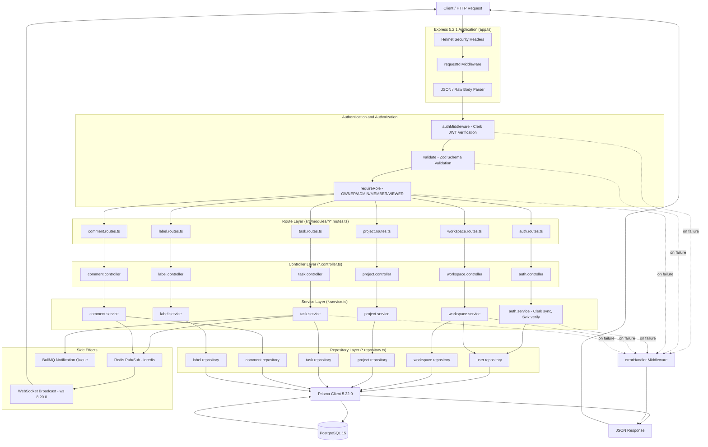

# Request Flow Diagram (Layered Architecture)

**Project:** flowspace
**Architecture Pattern:** Layered (Routes > Controllers > Services > Repositories)
**Backend Stack:** Express 5.2.1 (Node.js + TypeScript)
**Database:** PostgreSQL 15
**ORM:** Prisma 5.22.0

---

## Overview

FlowSpace follows a strict **layered architecture** (not classical MVC). Every HTTP request flows through a
predictable pipeline of middleware, controllers, services, and repositories before reaching the database.
This separation of concerns makes the codebase easier to test, reason about, and extend.

The diagram below shows the full request lifecycle, from an incoming HTTP request through authentication,
validation, role-based access control, business logic, and persistence, and back to the JSON response.

---

## Request Flow

---

## Layer Responsibilities

| Layer | Responsibility | Example Files |
|-------|----------------|---------------|
| **Middleware** | Security headers, request IDs, body parsing, logging | `src/middleware/requireAuth.ts`, `src/middleware/validate.ts`, `src/middleware/errorHandler.ts` |
| **Routes** | URL wiring, middleware composition, handler mounting | `src/modules/task/task.routes.ts` |
| **Controllers** | Parse request, call service, shape HTTP response | `src/modules/task/task.controller.ts` |
| **Services** | Business logic, RBAC enforcement, side effects (pub/sub, queues) | `src/modules/task/task.service.ts` |
| **Repositories** | Prisma queries, data shaping | `src/modules/task/task.repository.ts` |
| **Prisma + DB** | SQL generation and persistence | `prisma/schema.prisma`, PostgreSQL 15 |

---

## Key Notes

- **Authentication:** every protected route passes through `authMiddleware` which verifies a Clerk JWT
  via `@clerk/backend`'s `verifyToken` and populates `req.user = { userId: verified.sub }`. When
  `NODE_ENV=development`, the middleware short-circuits and injects `req.user = { userId: 'test-user-1' }`
  without verifying any token — never deploy with `NODE_ENV=development`. The `POST /auth/webhook`
  route is verified via Svix instead of a Clerk JWT.
- **Request logging:** there is no dedicated request-logger middleware wired into `app.ts` today.
  `requestId` attaches a correlation id, and individual services log ad-hoc via Winston
  (`@/lib/logger`). A global Winston request logger is not currently mounted.
- **Validation:** Zod schemas (`*.schema.ts`) are attached via the `validate(schema)` middleware and
  reject invalid bodies with 400 responses before controllers run. Only `req.body` is validated;
  `req.params` and `req.query` are not passed to the schema.
- **RBAC:** `requireRole('OWNER', 'ADMIN', ...)` inspects the caller's `WorkspaceMember.role` to gate
  access. Most write endpoints require `OWNER` or `ADMIN`.
- **Middleware order (inconsistency):** `task.routes.ts`, `workspace.routes.ts`, and
  `project.routes.ts` use `authMiddleware → requireRole → validate → handler`. `comment.routes.ts`
  and `label.routes.ts` use `authMiddleware → validate → requireRole → handler`. New code should
  follow the `task.routes.ts` order; aligning the two older files is tracked in Technical-Debt.md.
- **Side effects:** task and comment services publish events through Redis pub/sub and enqueue
  notifications through BullMQ. WebSocket clients (ws 8.20.0) receive real-time updates.
- **Error handling:** any thrown error short-circuits to the global `errorHandler` middleware which
  maps errors to the unified JSON envelope `{ success: false, data: null, error: { code, message,
  fields? }, requestId }` and an appropriate HTTP status (400/401/403/404/409/500).

---
